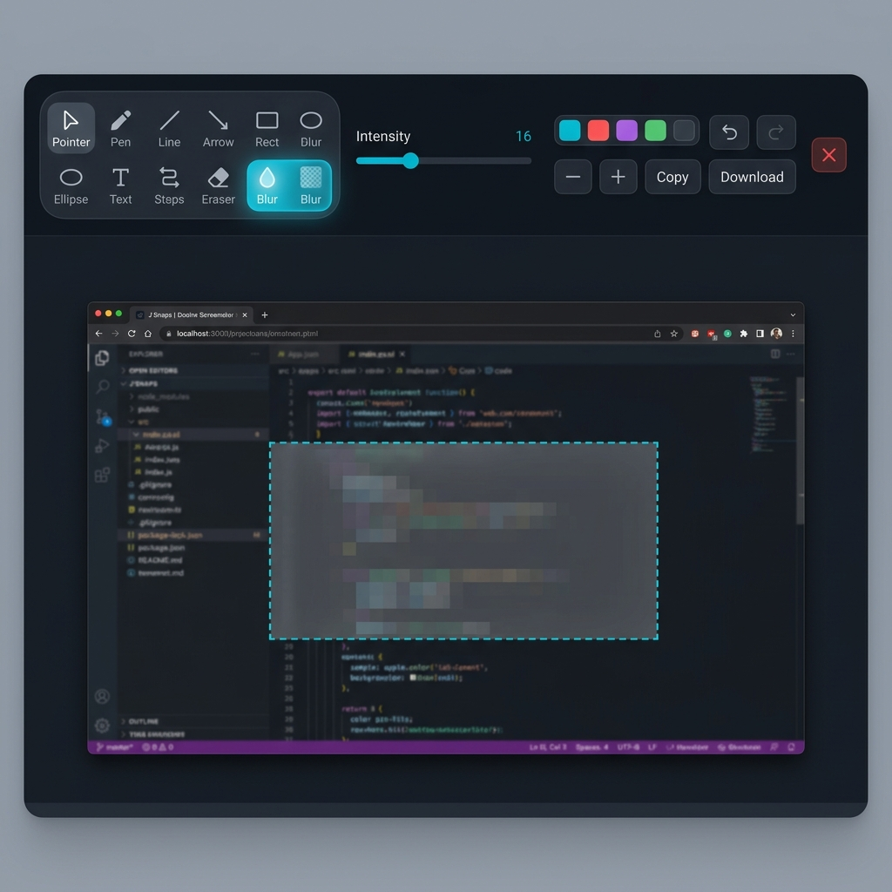
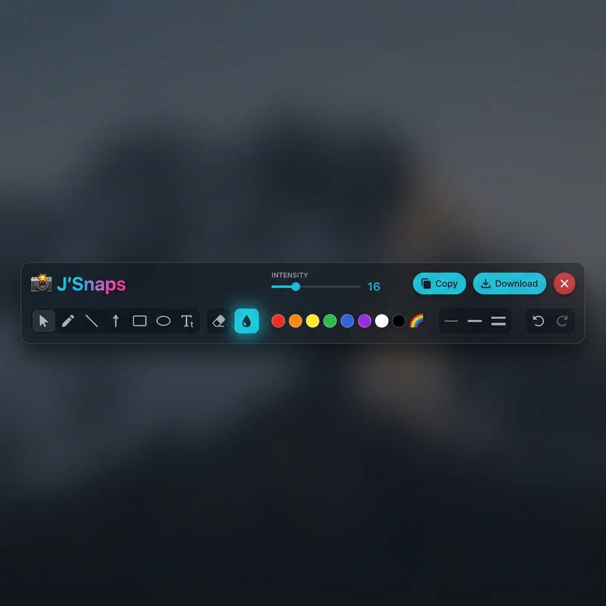

# J'Snaps

A lightning-fast, native desktop screenshot and annotation tool built with Electron.

J'Snaps brings the seamless "Lightshot" experience to your desktop. With a single global hotkey, you can silently freeze your entire screen, select an area, and instantly open a powerful, beautifully designed image editor to annotate and share your snapshot.

## Screenshots

### Editor — Blur / Redact Tool in Action


### Toolbar — Blur Tool Active with Intensity Slider


## Features
- 🚀 **Global Hotkey:** Press `Ctrl+Shift+S` anywhere on your computer to instantly freeze the screen.
- 🤫 **Silent Capture:** Native desktop screenshot integration without any browser prompts or pop-ups.
- 🎨 **Premium Editor:** A sleek, fully featured canvas editor that includes:
  - Pen, Line, Arrow, Rectangle, and Ellipse tools.
  - Text annotations.
  - Step counter markers.
  - 🌫️ **Blur / Redact tool** — drag over any region to blur sensitive info (passwords, emails, etc.). Adjustable intensity slider (4–40px). Shortcut: `B`.
  - Full Undo/Redo history support.
- 📋 **Seamless Export:** Copy directly to your clipboard or download as a PNG.

## Installation & Usage

1. **Install Dependencies**
   Make sure you have Node.js installed, then run:
   ```bash
   npm install
   ```

2. **Run in Development Mode**
   ```bash
   npm start
   ```

3. **Build the Windows Installer**
   To package J'Snaps into an official Windows Installer (Setup.exe):
   ```bash
   npm run build
   ```
   This will generate a `JSnaps Setup 1.0.0.exe` file inside the `installer` folder. You can distribute this setup file to install the app perfectly on any Windows machine.

4. **How to use**
   - Once running, J'Snaps sits silently in your Windows system tray.
   - Press **`Ctrl+Shift+S`** to trigger a screen capture.
   - Drag to select the area you want to capture.
   - The Editor will instantly open with your selection ready for annotation.

## Tech Stack
- **Electron** (Backend, IPC, Desktop Capturer, Global Shortcuts)
- **HTML5 Canvas** (Overlay freezing, image cropping, and editor rendering)
- **Vanilla JavaScript & CSS** (Zero bloated frameworks, maximum performance)
