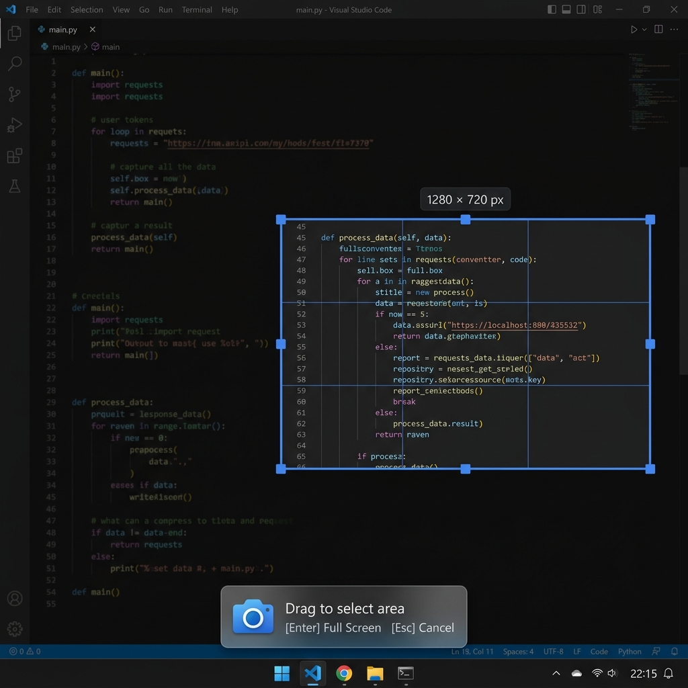
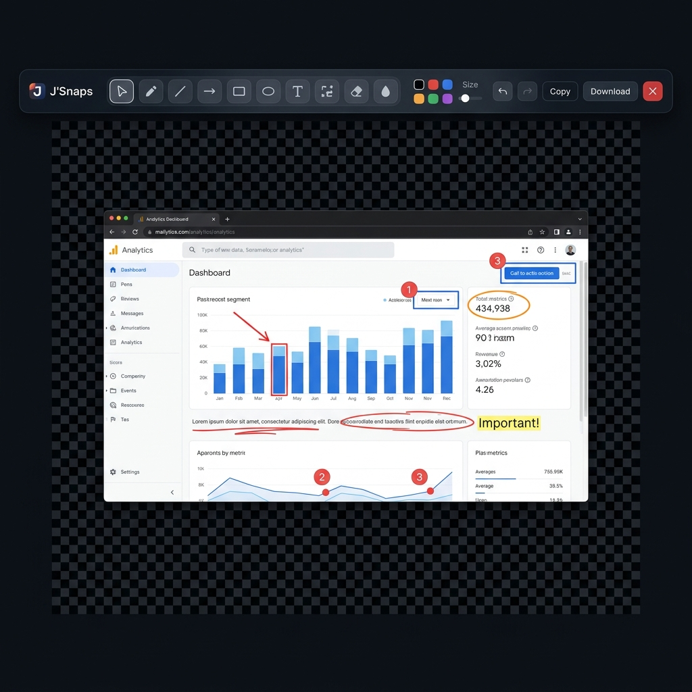
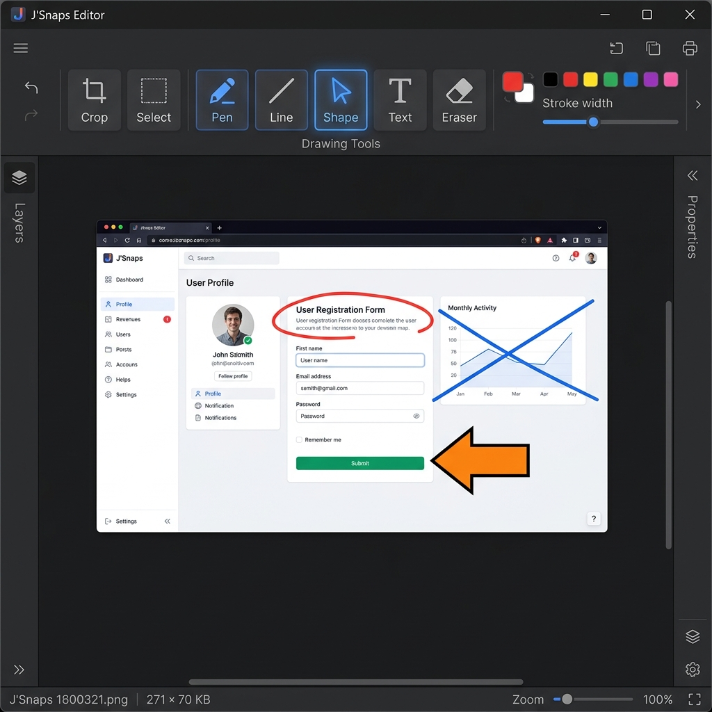
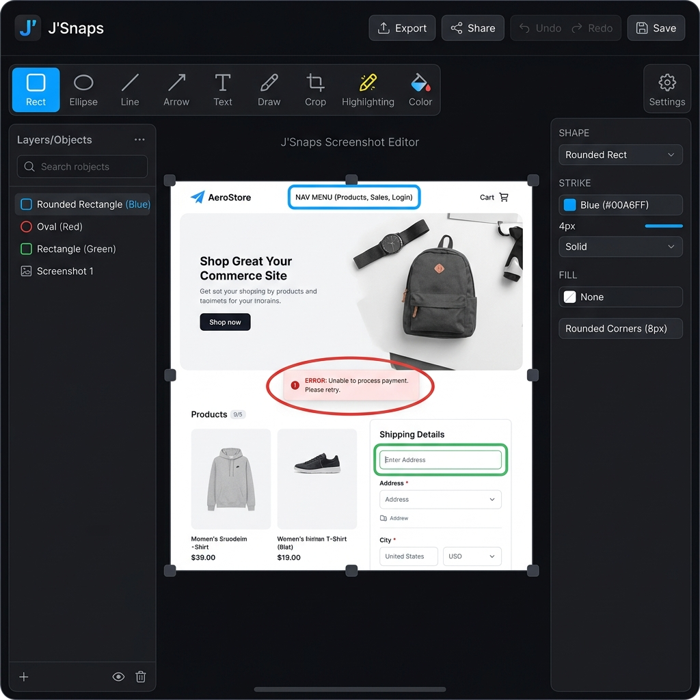
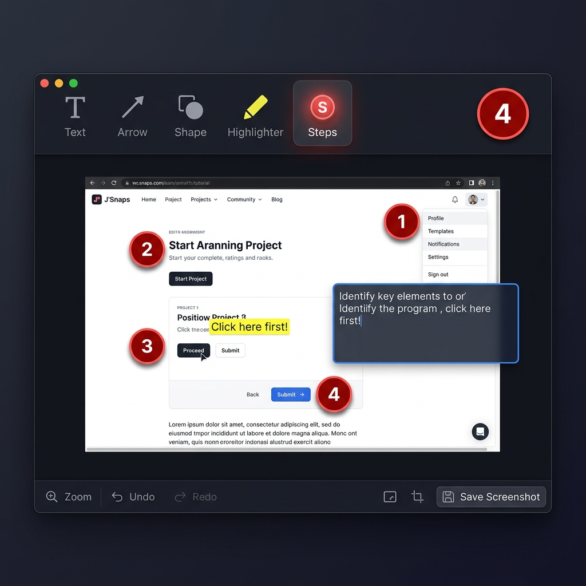
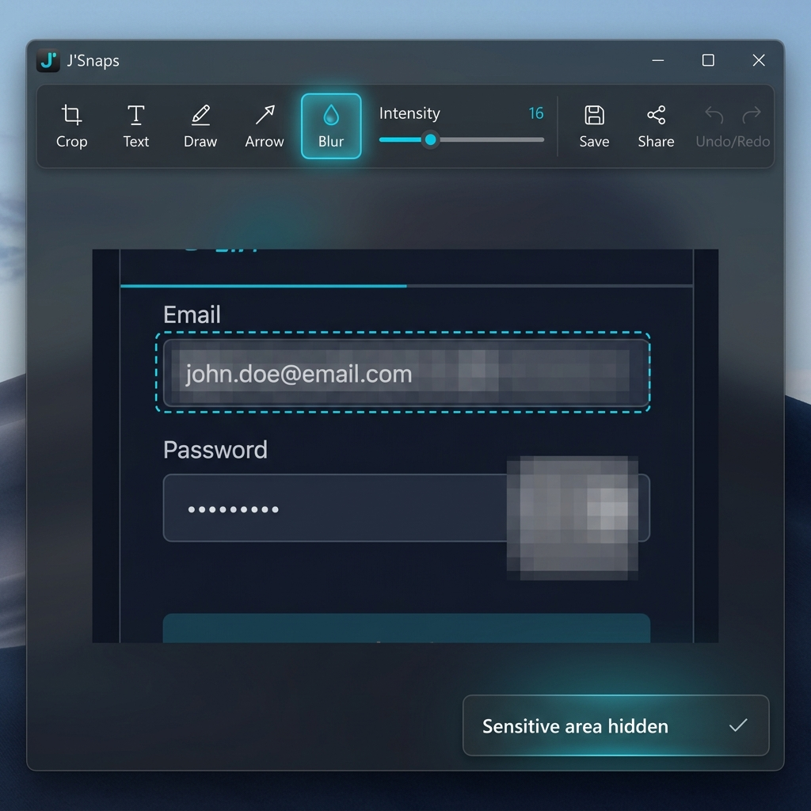
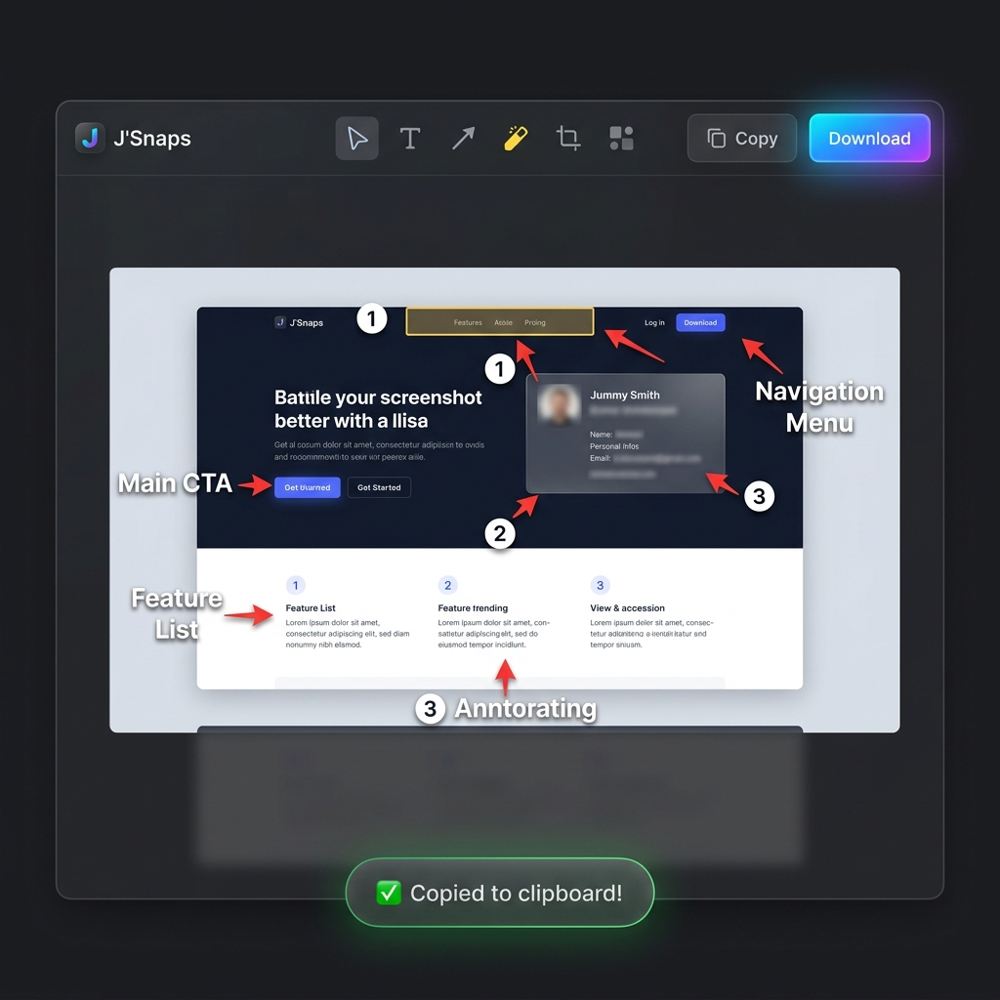

# J'Snaps

A lightning-fast, native desktop screenshot and annotation tool built with Electron.

J'Snaps brings the seamless "Lightshot" experience to your desktop. With a single global hotkey, you can silently freeze your entire screen, select an area, and instantly open a powerful, beautifully designed image editor to annotate and share your snapshot.

## Screenshots

### 1. 🎯 Screen Freeze & Area Selection

> Press `Ctrl+Shift+S` — the screen freezes instantly. Drag to select your capture area with pixel-precision.



---

### 2. 🖼️ Full Editor Overview

> A powerful, fully-featured annotation canvas with all tools ready to use.



---

### 3. ✏️ Pen, Line & Arrow Tools

> Freehand drawing, straight lines, and arrows with filled arrowheads for pointing out UI elements.



---

### 4. 🔲 Rectangle & Ellipse Shapes

> Highlight, frame, or circle any part of your screenshot with clean rounded shapes.



---

### 5. 🔤 Text Annotations & Step Counters

> Add text labels anywhere on the image. Use numbered step markers to guide users through a workflow.



---

### 6. 🌫️ Blur / Redact Tool

> Drag over any region to instantly blur sensitive information — passwords, emails, personal data.



---

### 7. 📋 Copy & Download Export

> One-click copy to clipboard or download as a PNG — ready to paste into Slack, Notion, Jira, or anywhere.



## Features

- 🚀 **Global Hotkey:** Press `Ctrl+Shift+S` anywhere on your computer to instantly freeze the screen.
- 🤫 **Silent Capture:** Native desktop screenshot integration without any browser prompts or pop-ups.
- 🎨 **Premium Editor:** A sleek, fully featured canvas editor that includes:
  - Pen, Line, Arrow, Rectangle, and Ellipse tools.
  - Text annotations.
  - Step counter markers.
  - 🌫️ **Blur / Redact tool** — drag over any region to blur sensitive info (passwords, emails, etc.). Adjustable intensity slider (4–40px). Shortcut: `B`.
  - Full Undo/Redo history support.
- 📋 **Seamless Export:** Copy directly to your clipboard or download as a PNG.
- 🔗 **Share Link:** Upload the annotated image and copy a link (`Ctrl+L`) — paste it into reports instead of embedding images. Hosts: Catbox (default, public, no setup) or your own Google Drive.

## Installation & Usage

1. **Install Dependencies**
   Make sure you have Node.js installed, then run:

   ```bash
   npm install
   ```
2. **Run in Development Mode**

   ```bash
   npm start
   ```
3. **Build the Windows Installer**
   To package J'Snaps into an official Windows Installer (Setup.exe):

   ```bash
   npm run build
   ```

   This will generate a `JSnaps Setup <version>.exe` file inside the `installer` folder. You can distribute this setup file to install the app perfectly on any Windows machine.
4. **How to use**

   - Once running, J'Snaps sits silently in your Windows system tray.
   - Press **`Ctrl+Shift+S`** to trigger a screen capture.
   - Drag to select the area you want to capture.
   - The Editor will instantly open with your selection ready for annotation.

## Share Link Setup

**Catbox (default):** no setup. Links are public and permanent — anyone with the link can view the image. Use the Blur tool on sensitive info first.

**Google Drive (optional):** tray icon → **Sign in with Google Drive**, pick your Google account, and approve access. Images go to a `JSnaps` folder in your Drive and are set to "anyone with the link can view". J'Snaps can only see files it created. Use **Sign out of Google Drive** to revoke access. Switch hosts any time from tray → **Share host**.

**Advanced (own credentials):** tray → **Advanced: use my own credentials…** lets you use your own Google Cloud OAuth client instead of the built-in one.

### Maintainer setup (one-time, for built-in Google sign-in)

1. In [Google Cloud Console](https://console.cloud.google.com/), create a project and enable the **Google Drive API**.
2. Configure the OAuth consent screen: app name "J'Snaps", icon, support email, privacy policy URL, scope `https://www.googleapis.com/auth/drive.file` only. Set publishing status to **In production** and submit for brand verification to remove the "unverified app" warning.
3. Create credentials → **OAuth client ID** → application type **Desktop app**.
4. Copy `share/gdrive-config.example.json` to `share/gdrive-config.json` and enter the Client ID and secret, then rebuild. See [Technical Documentation](docs/TECHNICAL.md) for full setup instructions.

## Privacy & Terms

- [Privacy Policy](PRIVACY.md) — Details on permissions, local data encryption, and cloud sharing.
- [Terms of Service](TERMS.md) — Acceptable use and service terms for J'Snaps.

## Tech Stack

- **Electron** (Backend, IPC, Desktop Capturer, Global Shortcuts)
- **HTML5 Canvas** (Overlay freezing, image cropping, and editor rendering)
- **Vanilla JavaScript & CSS** (Zero bloated frameworks, maximum performance)
